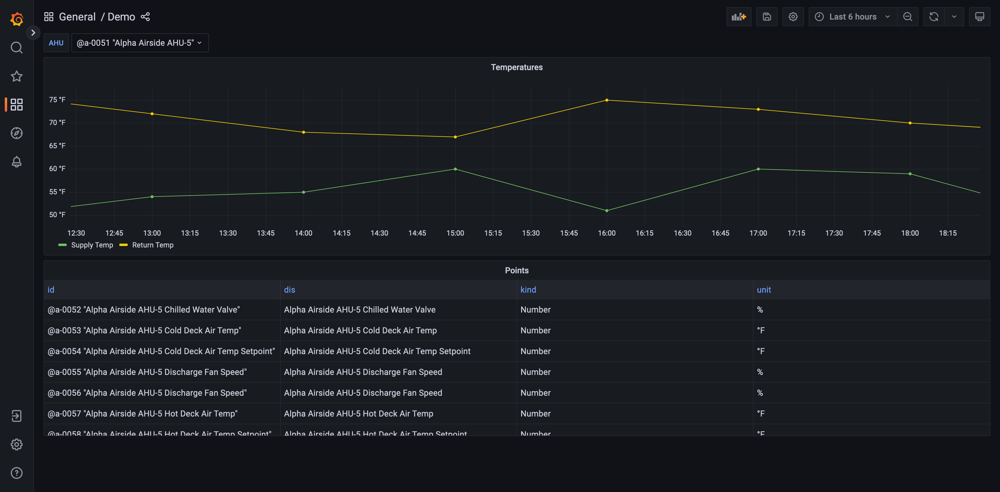

# Grafana Data Source Plugin for Project Haystack

This is a [Grafana](https://grafana.com/grafana/) plugin that supports direct communication with a
[Project Haystack API Server](https://project-haystack.org/doc/docHaystack/HttpApi). It handles authentication
and supports standard Haystack API operations as well as custom Axon execution, which is supported by
[SkySpark](https://skyfoundry.com/product) and [Haxall](https://haxall.io/).

You can find more information on the
[Haystack Grafana Plugin Page](https://grafana.com/grafana/plugins/needleinajaystack-haystack-datasource/)

## Installation

This data source plugin may be installed within the Grafana "Connect data" UI on compliant versions.  

## Usage

To use this package, [install and configure a Grafana server](https://grafana.com/docs/grafana/latest/). Then follow
the instructions in the [plugin readme](./src/README.md)

## Contributing

Contributions are very welcome! For details on how to develop this plugin, see the
[development guide](./DEVELOPMENT_GUIDE.md).

